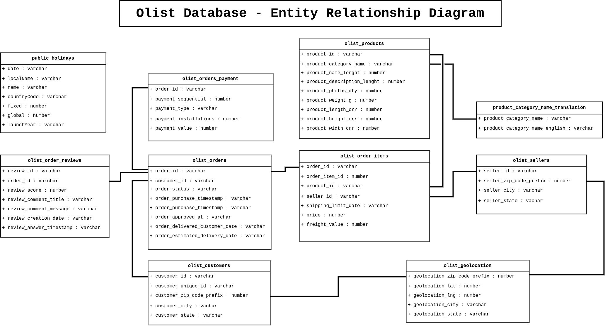

# Olist Database Documentation

## Diagrama Entidad Relación

## Infomación de las Tablas

## `product_category_name_translation`
Almacena la traducción de los nombres de las categorías de productos.
- `product_category_name_translation`: Traducción del nombre de la categoría del producto.
- `product_category_name`: Nombre de la categoría del producto en el idioma original.
- `product_category_name_english`: Nombre de la categoría del producto en inglés.

## `olist_sellers`
Información relacionada con los vendedores en la plataforma.
- `seller_id`: Identificador único del vendedor.
- `seller_zip_code_prefix`: Prefijo del código postal del vendedor.
- `seller_city`: Ciudad del vendedor.
- `seller_state`: Estado del vendedor.

## `olist_customers`
Información de los clientes que han realizado pedidos.
- `customer_id`: Identificador único del cliente (interno).
- `customer_unique_id`: Identificador único del cliente (externo).
- `customer_zip_code_prefix`: Prefijo del código postal del cliente.
- `customer_city`: Ciudad del cliente.
- `customer_state`: Estado del cliente.

## `olist_geolocation`
Información geográfica de los clientes y vendedores.
- `geolocation_zip_code_prefix`: Prefijo del código postal.
- `geolocation_lat`: Latitud de la ubicación.
- `geolocation_lng`: Longitud de la ubicación.
- `geolocation_city`: Ciudad de la ubicación.
- `geolocation_state`: Estado de la ubicación.

## `olist_order_payments`
Información sobre los pagos de los pedidos.
- `order_id`: Identificador único del pedido.
- `payment_sequential`: Secuencia de pagos asociados a un pedido.
- `payment_type`: Tipo de pago utilizado (tarjeta de crédito, boleto, etc.).
- `payment_installments`: Número de cuotas en que se realizó el pago.
- `payment_value`: Valor total del pago.

## `olist_order_reviews`
Reseñas de los pedidos realizados por los clientes.
- `review_id`: Identificador único de la reseña.
- `order_id`: Identificador único del pedido asociado a la reseña.
- `review_score`: Puntuación otorgada al pedido (1 a 5).
- `review_comment_title`: Título del comentario de la reseña.
- `review_comment_message`: Mensaje detallado de la reseña.
- `review_creation_date`: Fecha de creación de la reseña.
- `review_answer_timestamp`: Fecha de la respuesta de la reseña.

## `public_holidays`
Días festivos públicos, en este caso de Brasil.
- `date`: Fecha del día festivo.
- `localName`: Nombre local del día festivo.
- `name`: Nombre oficial del día festivo.
- `countryCode`: Código del país.
- `fixed`: Indica si la fecha del día festivo es fija o variable.
- `global`: Indica si es un día festivo de alcance global.
- `launchYear`: Año en que comenzó a celebrarse el día festivo.

## `olist_orders`
Información general de los pedidos realizados.
- `order_id`: Identificador único del pedido.
- `order_status`: Estado actual del pedido (en tránsito, entregado, etc.).
- `order_purchase_timestamp`: Fecha y hora en que se realizó el pedido.
- `order_approved_at`: Fecha y hora en que se aprobó el pago.
- `order_delivered_carrier_date`: Fecha en que el transportista entregó el pedido al cliente.
- `order_delivered_customer_date`: Fecha en que el cliente recibió el pedido.
- `order_estimated_delivery_date`: Fecha estimada de entrega.

## `olist_products`
Información de los productos vendidos en la plataforma.
- `product_id`: Identificador único del producto.
- `product_category_name`: Nombre de la categoría del producto.
- `product_name_length`: Longitud del nombre del producto.
- `product_description_length`: Longitud de la descripción del producto.
- `product_photos_qty`: Cantidad de fotos del producto.
- `product_weight_g`: Peso del producto en gramos.
- `product_length_cm`: Longitud del producto en cm.
- `product_height_cm`: Altura del producto en cm.
- `product_width_cm`: Ancho del producto en cm.

## `olist_order_items`
Detalles de los ítems dentro de los pedidos.
- `order_id`: Identificador único del pedido.
- `order_item_id`: Identificador del ítem dentro del pedido.
- `product_id`: Identificador único del producto.
- `seller_id`: Identificador único del vendedor.
- `shipping_limit_date`: Fecha límite de envío.
- `price`: Precio del producto.
- `freight_value`: Valor del flete.

# Relaciones entre las Tablas

### Pedidos y Clientes:
La tabla `olist_orders_dataset` está conectada con `olist_order_customer_dataset` a través del campo `customer_id`. Esto significa que un pedido está vinculado a un cliente en la tabla de clientes.

### Pedidos y Productos:
La tabla `olist_order_items_dataset` está vinculada con `olist_products_dataset` a través del campo `product_id`. Esto relaciona cada ítem del pedido con un producto específico en la tabla de productos.

### Pedidos y Vendedores:
La tabla `olist_order_items_dataset` está vinculada a la tabla `olist_sellers_dataset` por el campo `seller_id`, lo que significa que los ítems de un pedido están asociados a un vendedor.

### Pedidos y Pagos:
La tabla `olist_order_payments_dataset` está relacionada con `olist_orders_dataset` a través del campo `order_id`. Esto significa que los pagos están vinculados a un pedido específico.

### Pedidos y Reseñas:
La tabla `olist_order_reviews_dataset` está conectada con `olist_orders_dataset` mediante el campo `order_id`. Esto indica que las reseñas están asociadas a pedidos específicos.

### Geolocalización:
La tabla `olist_order_customer_dataset` está conectada con `olist_geolocation_dataset` mediante el campo `zip_code_prefix`. Esto significa que la información de geolocalización está asociada a un cliente a través del código postal.

### Vendedores y Geolocalización:
La tabla `olist_sellers_dataset` también está conectada a la tabla `olist_geolocation_dataset` mediante el campo `zip_code_prefix`, lo que significa que los vendedores tienen datos geográficos asociados a su código postal.